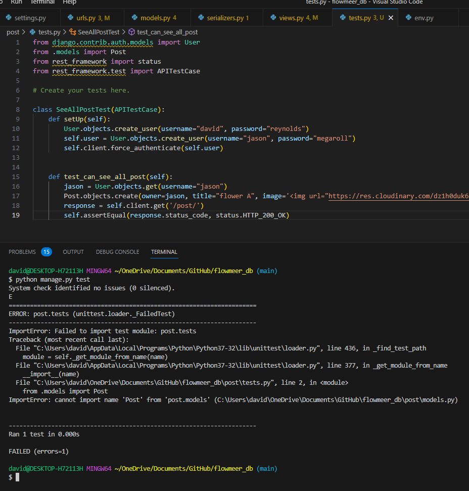

# $${\color{red}FLOW\color{green}ME\color{red}ER}$$
*A website to share botanical experiences with flower lovers alike.*

**Index**
- [Introduction](#Introduction)
- [Setting Up](#SetUp)
- [Midway testing](#Testing)
- [Methodology](#Method)
- [Use of API Database](#how-this-database-affects-my-front-end-project)

## Introduction
This repository is created as an API application to receive, process, store and retrieve data for the front end React.js application FLOWMEER.

|Link to the live website is here:||
|----|----|
| | https://flowmeer.herokuapp.com |
| README Page: | https://github.com/FluffyBullet/flowmeer |

|Link to the live Database is here:||
|----|----|
| | https://flowmeerdb.herokuapp.com |
| README Page: | https://github.com/FluffyBullet/flowmeerdb |

To display ability of creating application software of backend and frontend, this repository uses django language with RESTful installations. 

Later in the development of my course - I found minor edits being made to the models to help store information more efficiently and adjust requirements such as the filter options.

## SetUp

The database/back-end of an application is the first feature for creation as you set up "models", reffered as tables, on how to store the data, link together and process efficiently.
On first setup, I drew a table diagram using MS Excel to help organize the data and how they will correlate with each other. 

__post__

The post of the website will contain an __image__ paired with a __title__.

Key features of the post will include __flower_tag and __owner__. The __Post ID__ is automatically implemented by the django's model.Models function. __Created_at__ will help the sort by newest post first.

Whilst the project developed, I've opted to to remove the __Region__ filter and made note this will be to be included later.

__comment__

Pairing with the post model, each post will be permitted for a list of comments made from author and other users.
For this, the comment model will need to contain unique ID - stored as __comment_id__. Another automated id field generated by the Django model. __Post_id__ will be used as a foreign key on this table to aid the connection between both tables. 

__counter__

Originally listed as counter, this was edited to be displayed as a Vote system, where others can vote for the post and be displayed with popularity.
Unfotunately with time schedules, votes are enabled, but yet to be utilized on this project, allowing users to sort post by order of most voted and within the family flower category.

__post_id__ will be a foreign key, allowing the table to determine which post has the vote generated against.

__liked_by__ will be linked with the owner of the like with the post. Combination of both id's will limit the table to include 1 like per user per post.

## Testing
On creation of tables, I used django's included APITestCase to ensure data is processed correctly. Pairing this will manual testing, I found this approach allowed me to display potential bugs and repair before causing complications later in the line.

Testing is also followed up with behaviour driven development on completion of the project. This is advised on the front end readme file with a table to advise of expected behaviours and their outcomes.

__posttest__ 
**************

This section is created for testing that a user can view all post, the first image is created to fail - confirming that the testing will not automatically default to pass.

*******************

this section is creating to test when creating a post, the image is uploaded onto the server.

************************

## Method

Creation of the database begins with using python's Django framework, which works closely with RESTful API libraries.

In your IDE, open a folder you wish to create your project in and install django with the following command in your terminal:

    pip3 install django

Alternatively, you can specify the version of django you wish to install, by following with a @ tag and the version reference. i.e:

    pip3 install django@3.2.19 (for Dec 2021 version)

Your project will be headed by a "project" then followed by several "applications". Your project will include settings on how the applications behave and routing list.

To create the project, head to your terminal list and enter:

    pip3 install django-admin startproject .

*note the dot at the end is an important addition, commanding the project to be created inside the current folder.*

Creating individual apps thereafter can be created by running a command line prompt:

    django manage.py createapp <enter name here>

replacing your chosen name between angled brackets.

To link your app with your project, head to settings.py in your project you created first, focusing on "INSTALLED_APPS", adding your application to the project.

further guides can be found on: https://www.w3schools.com/django/index.php

### Creating a Branch of my database project

To create fork of my respository, navigate to the database respository either above or here:https://github.com/FluffyBullet/flowmeerdb

On the light grey banner across the top, select the dropdown menu adjacent to "Fork", chosing the option to create a new fork.

This will allow you to make a replicate of my project and save on your personal (or chosen) github account for further developments.

### Deploying the database onto the web

Whilst this application will allow processing of data and feeding back information required, two further steps are required to make this operational.

1. Creating a Database.
    - Visit a host website, signing up for their database and options. In this event, I chose https://www.elephantsql.com/, signing up for their free option of Tiny Turtle Plan.
    - Upon creation of your database, you will be provided with an API Key. This information is required to be added into your env.py file, but keep secret from the public. This is also to be stored as a variable in the Heroku application.
1. Create app project in Heroku
    - An account will need to be created for salesforce/heroku to continue.
    - Within the heading banner of your logged in page, you can create a new application.
    - Link your respository for the database with Heroku, then either pushing for manual deployment on heroku, or automatic.
    - Once your app is created, head over to the settings tab, where you are met with the inner-workings of the application. Here you will find a section dedicated for config var (variables).
        - Within this section, you are required to enter variables which allow your database to communicate with. This includes; allowed host, client origin, database url and any other external url's you are using.

## How this database affects my front end project:

On deployment my database receives a URL to be stored within the database as a config variable. This allows request via the URL to be processed within the database - on provision JWT Tokens, authorized users and other variables match. 

My front end application use the url as an API route to send a stringified (JSON) package for processing.
In my front end application I'm using Axios to make connection with my API and return the response. Axios is a great tool for use with React as access tokens are only granted for 5 minutes, although a key permitted from the API Connection is suitable for 24 hours.

Setting up Axios interceptors, on each request a check is made to make sure the tokens are valid and if not refresh the mentioned token to authorize the connection.

